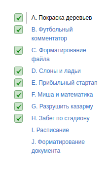

<h1>
Лекция 1: Сложность, тестирование, особые случаи
</h1>

Видите ошибку? А она есть! Стресса от этого не будет у тех, кто умеет писать стресс-тестирование. А сложностей — у тех, кто умеет использовать оценку сложности алгоритмов на практике. Всему этому научимся на этой лекции.

Дедлайн 12.03 18:00 по МСК

 

 

