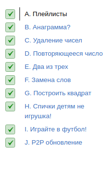

<h1 align="center">
Лекция 3: Множества и словари
</h1>

Откуда возникает 90% тормозов? Из-за использования линейного поиска вместо множеств и словарей. Разберемся как эти структуры устроены внутри (спойлер: как хеш-таблица), как их использовать на практике и чем амортизированная сложность отличается от ароматизированной.

Дедлайн 27.03 18:00 по МСК

 

 

